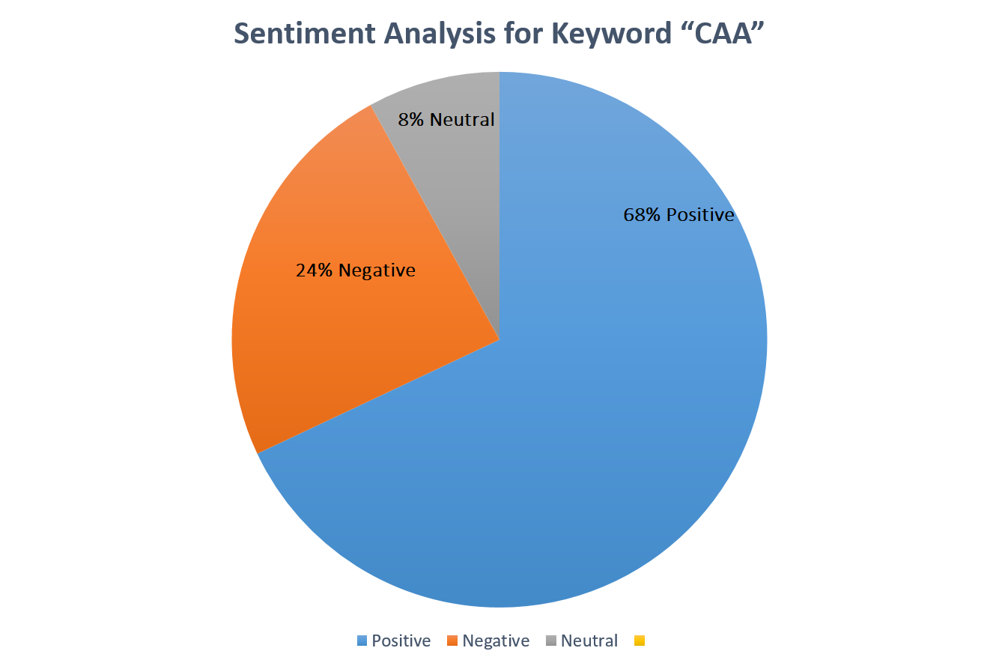

<h1> Live-Twitter-Sentiment-Analysis</h1>
Identifying the real status of poilitical issues is very important for maintaining peace in the surroundings.
Twitter being a very big social media platform having 17+ Millions Indian Users . Every person has its different views on a particular topic .
So there is no shortage of data , Right ?
Yes We have too much data on every next topic . We just need to analyse the flow of thoughts and here Comes Natural Language Processing to make it done .

I used Natural Language Processing to identify the nature of some tweets and predicts the current status of a particular word . Say "CAA" (Citizenship Amendment Act).
The nature of a tweet can be mainly divided into :
1.) Positive
2.) Negative
3.) Neutral

<h3>Processing</h3>
1.) Fetching Tweets using Twitter API with the help of Tweepy Library.
2.) Identify the polarity of each tweet
3.) Present the overall distribution of Nature of various tweets.

 

